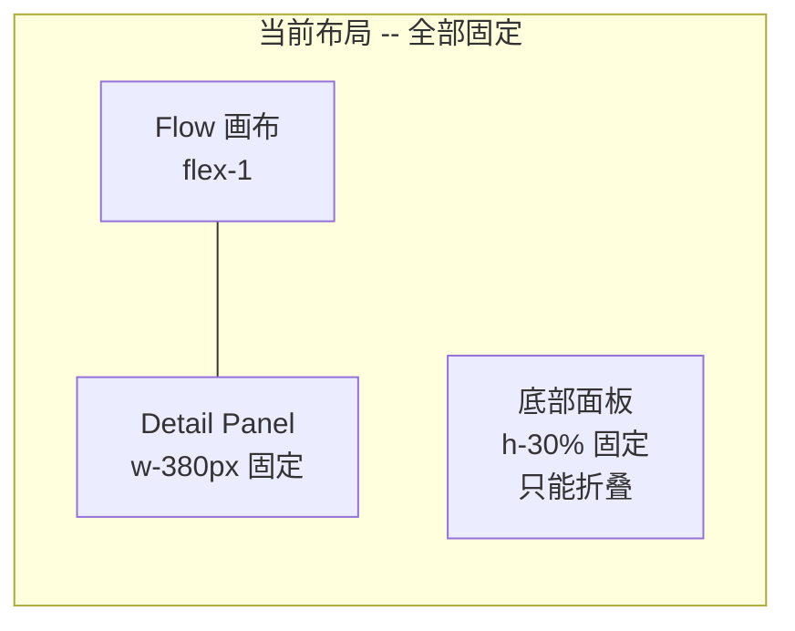
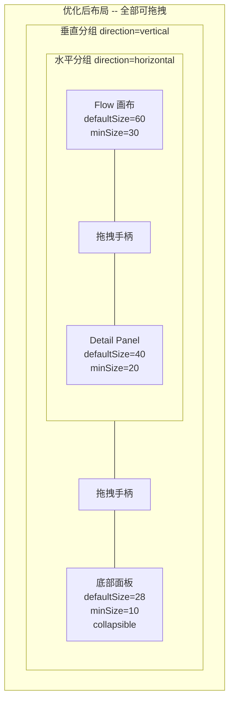
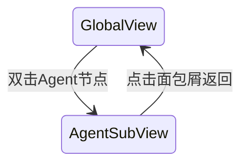

# 前端面板灵活性优化

## 当前问题分析

### 问题 1: 面板大小完全不可调

当前 [WorkspacePage.tsx](frontend/src/pages/WorkspacePage.tsx) 使用硬编码尺寸:

- 右侧详情面板: `w-[380px]` 固定宽度，无法拖拽
- 底部面板: `h-[30%]` 固定高度，只能折叠/展开，不能拖拽调整
- 左右分隔线: 纯 `w-px bg-border` 的装饰线，无交互
- 上下分隔: 一个按钮做折叠，无拖拽手柄




### 问题 2: 上传交互不直观

当前上传入口仅是输入框左侧一个小回形针图标 (Paperclip)，存在以下问题:

- 视觉权重太低，容易被忽略
- 没有区分图片和视频上传的视觉提示
- 没有拖拽上传的视觉引导 (虚线框)
- 上传预览区在有文件时才出现，空状态无引导

---

## 优化方案

### 方案 1: 可拖拽调整面板大小

**技术选型**: 安装 `react-resizable-panels` (npm 周下载量 170w+，体积约 4KB gzip，专为此场景设计)

**目标布局**: 两层嵌套的 ResizablePanelGroup




**改动文件**: [WorkspacePage.tsx](frontend/src/pages/WorkspacePage.tsx)

核心变更:

- 外层 `ResizablePanelGroup direction="vertical"` 管理上下分组
- 内层 `ResizablePanelGroup direction="horizontal"` 管理左右分组
- 每个分隔处放 `PanelResizeHandle`，样式为窄条 + hover 变宽变色 + cursor 指示
- 底部面板设 `collapsible`，配合 `onCollapse/onExpand` 回调替代手动折叠按钮
- 删除硬编码的 `w-[380px]`、`h-[70%]`、`h-[30%]`

**ResizeHandle 样式**: 符合暗色主题的拖拽手柄

```tsx
// 水平手柄 (左右拖拽)
<PanelResizeHandle className="w-1.5 bg-border hover:bg-primary/50 transition-colors cursor-col-resize
  flex items-center justify-center group">
  <div className="w-0.5 h-8 bg-gray-600 group-hover:bg-primary rounded-full" />
</PanelResizeHandle>

// 垂直手柄 (上下拖拽)
<PanelResizeHandle className="h-1.5 bg-border hover:bg-primary/50 transition-colors cursor-row-resize
  flex items-center justify-center group">
  <div className="h-0.5 w-8 bg-gray-600 group-hover:bg-primary rounded-full" />
</PanelResizeHandle>
```

### 方案 2: 重新设计上传交互

**改动文件**: [BottomPanel.tsx](frontend/src/components/bottom/BottomPanel.tsx), [ChatPage.tsx](frontend/src/pages/ChatPage.tsx)

**核心变更**: 删除输入框左侧的附件按钮 (Paperclip)，改为在输入框上方**始终显示**两个虚线框 dropzone:

```
+------------------------------------------------------------------+
|  +---------------------------+  +---------------------------+     |
|  |         - - - - -         |  |         - - - - -         |     |
|  |     [Image icon]          |  |     [Video icon]          |     |
|  |         +                 |  |         +                 |     |
|  |    点击或拖拽添加图片       |  |    点击或拖拽添加视频       |     |
|  |         - - - - -         |  |         - - - - -         |     |
|  +---------------------------+  +---------------------------+     |
|                                                                    |
|  [已上传的文件缩略图们...]                                          |
+------------------------------------------------------------------+
|  描述你想创作的视频...                                   | [发送]   |
+------------------------------------------------------------------+
```

**具体设计要点**:

- **删除**输入框左侧的 Paperclip 附件按钮 (已被虚线框完全取代)
- 上传区**始终可见**，不需要展开/收起
- 两个虚线框并排: 左侧"上传图片" (ImageIcon + Plus)，右侧"上传视频" (VideoIcon + Plus)
- 虚线框样式: `border-dashed border-2 border-gray-600 rounded-lg`，hover 时 `border-primary/50`
- 拖拽文件到虚线框上方时高亮 (dragover 状态变为 `border-primary bg-primary/5`)
- 点击虚线框触发对应类型的文件选择 (`accept="image/*"` 或 `accept="video/*"`)
- 已上传文件的缩略图在虚线框下方横排展示，保留现有的预览+删除逻辑
- 输入框行只保留 textarea + 发送按钮，更简洁

**ChatPage 同步优化**:

- 在输入框上方也加入同样的虚线框上传区，始终可见

### 方案 3: 拖拽上传全局增强

- 拖拽文件到整个 BottomPanel 区域时显示全区 overlay 提示 "释放以上传文件"
- 自动根据文件 MIME 类型分类到图片/视频
- 上传过程中虚线框内显示 loading spinner

### 方案 4: Agent 节点双击展开为内部子图

**目标**: 双击任意 Agent 节点 → 主画布切换为该 Agent 的内部视图，展示 LLM 与工具的实时交互。

**交互流程**:




**Agent 内部子图布局**:

```
[面包屑: 全局视图 > Planner]

                  ┌─────────────────┐
                  │   LLM (豆包)     │
                  │   ● 思考中...    │
                  └────────┬────────┘
            ┌──────────────┼──────────────┐
            │              │              │
     ┌──────▼──────┐ ┌─────▼──────┐ ┌────▼───────┐
     │ think        │ │ submit_plan│ │ analyze    │
     │ ──────────── │ │ ──────────-│ │ _image     │
     │ 内部推理工具  │ │ 提交制作计划│ │ VLM分析图片 │
     │              │ │            │ │            │
     │ ● 已调用     │ │ ○ 空闲     │ │ ○ 空闲     │
     │ 输入: {...}  │ │            │ │            │
     │ 输出: {...}  │ │            │ │            │
     └──────────────┘ └────────────┘ └────────────┘
```

#### 4.1 后端: 工具级 WebSocket 事件

**改动文件**: [callbacks.py](backend/app/graph/callbacks.py)

在 `StreamingWSCallback` 中新增两个回调方法:

```python
async def on_tool_start(self, serialized, input_str, **kwargs) -> None:
    tool_name = serialized.get("name", "unknown")
    await ws_manager.broadcast(self.project_id, {
        "type": "tool_call_start",
        "agent": self.agent_name,
        "tool": tool_name,
        "input": input_str[:500],  # 截断防止过大
        "timestamp": time.time(),
    })

async def on_tool_end(self, output, **kwargs) -> None:
    await ws_manager.broadcast(self.project_id, {
        "type": "tool_call_end",
        "agent": self.agent_name,
        "tool": kwargs.get("name", "unknown"),
        "output": str(output)[:500],
        "timestamp": time.time(),
    })
```

新增 2 种 WebSocket 事件类型 (总计 12 种):

- `tool_call_start` -- `{agent, tool, input, timestamp}`
- `tool_call_end` -- `{agent, tool, output, timestamp}`

#### 4.2 前端: 类型定义和状态管理

**改动文件**: [types.ts](frontend/src/types.ts)

新增类型:

```typescript
export type ToolCallStatus = 'idle' | 'calling' | 'success' | 'error'

export interface ToolCallInfo {
  toolName: string
  status: ToolCallStatus
  input?: string
  output?: string
  startTime?: number
  endTime?: number
}

export interface ToolNodeData {
  name: string
  description: string
  status: ToolCallStatus
  input?: string
  output?: string
  callCount: number
}
```

**改动文件**: [useAgentFlow.ts](frontend/src/hooks/useAgentFlow.ts)

新增状态:

```typescript
const [toolCalls, setToolCalls] = useState<Record<string, ToolCallInfo[]>>({})
// key = agentId, value = 该 agent 的工具调用历史
```

新增 WebSocket 事件处理:

```typescript
case 'tool_call_start':
  // 更新对应 agent 的对应 tool 状态为 calling + 记录 input
case 'tool_call_end':
  // 更新对应 tool 状态为 success + 记录 output
```

#### 4.3 前端: ToolNode 组件

**新建文件**: `frontend/src/components/flow/nodes/ToolNode.tsx`

每个工具节点显示:

- 工具名称 (粗体)
- 一句话描述 (灰色小字)
- 调用状态指示器 (idle=灰色, calling=蓝色脉冲, success=绿色, error=红色)
- 调用计数 badge
- 输入/输出参数折叠预览 (点击展开 JSON)

节点尺寸比 AgentNode 小，约 `w-44`。

#### 4.4 前端: AgentSubFlowView 组件

**新建文件**: `frontend/src/components/flow/AgentSubFlowView.tsx`

组件职责:

- 接收 `agentId` + `toolCalls` + `toolList` (从 admin API 获取)
- 中心放一个 LLM 节点 (显示 Agent 名称 + 模型 + 状态)
- 周围放射状排列该 Agent 的所有工具节点
- LLM → Tool 之间的边在工具被调用时动画高亮
- 实时更新工具节点的 input/output 预览

布局算法: 工具节点以 LLM 为圆心，半径 200px，均匀分布在圆周上。

#### 4.5 前端: 画布钻入集成

**改动文件**: [AgentFlowCanvas.tsx](frontend/src/components/flow/AgentFlowCanvas.tsx)

新增状态:

```typescript
const [viewMode, setViewMode] = useState<
  { type: 'global' } | { type: 'agent'; agentId: string }
>({ type: 'global' })
```

交互逻辑:

- 双击 Agent 节点 → `setViewMode({ type: 'agent', agentId: node.id })`
- `viewMode.type === 'agent'` 时渲染 `AgentSubFlowView` 替代全局 Flow
- 顶部显示面包屑: `全局视图 > {agentName}`，点击"全局视图"返回
- 返回时保留之前的全局 Flow 状态 (节点位置、缩放等)
- 单击节点仍然触发右侧面板切换 (不变)

---

## 不涉及的范围

- 不改动右侧 NodeDetailPanel 内部的 Tab 内容
- 不改动后端 Agent 逻辑和 API 接口
- 不改动 LangGraph 状态图结构

